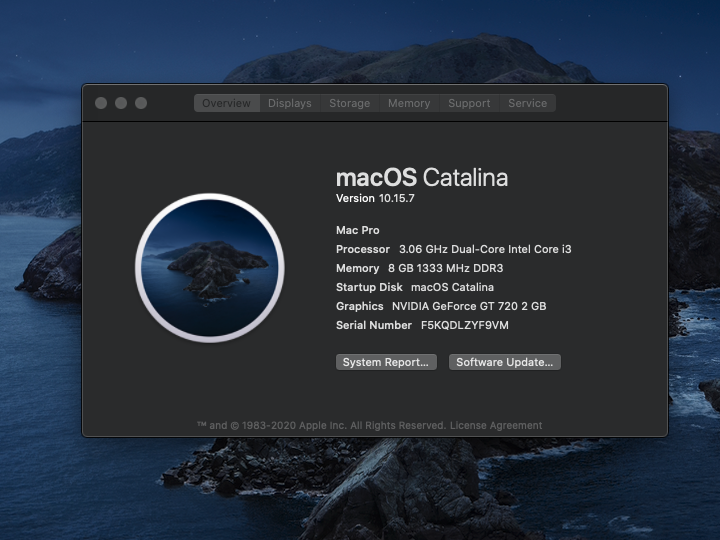

# For Non UEFI Clarkdale and Lynnfield (Bios Legacy)

This EFI is specific for any `(LGA 1156)` 1st gen Intel Core i Series (Core i3,i5,i7) even Intel Xeon Processor limited to Clarkdale and Lynnfield.

## Hardware and Supported macOS version

SMBios: `MacPro6,1`

| Type            | Spec                                |
|-----------------|-------------------------------------|
| Computer        | HP Pavilion p6355d                  |
| BIOS Version    | American Megatrends 5.15            |
| CPU             | Intel i3 540 3.07 GHz               |
| Motherboard     | MS-7613 (IONA v1.0)                 |
| Ethernet        | Gigabit 1.0 Gbps       	        |
| Firewire        | 400                 	        |
| Memory          | 8GB DDR3-1333 MHz                   |
| Graphics        | Nvidia GT 720 2GB.                  |
| Storage         | WDC WD10EZEX                        |
| VGA & HDMI Port | Max Full HD                         |

Tested: 
OS X El Capitan ---> macOS Catalina

Not Tested but it will work:
macOS BigSur ---> macOS Monterey

Not Tested:
OS X Mavericks
